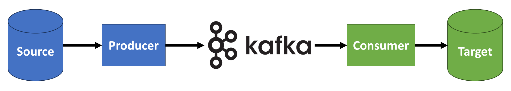

# Apache Kafka

Apache Kafka is a distributed, high-performance messaging system that enables the decoupling of source and target systems. It is widely used for real-time data streaming and communication between different systems. It provides high performance, scalability, and fault tolerance, making it widely used in various industries for applications like real-time recommendations, analytics, and microservices.

- Having many source and target systems becomes complex
- E.g. 4 source and 6 targets equals 24 integrations
- Each integration has different protocol (TCP, HTTP etc.), data format (JSON etc.), data schema and evolution
- Decouple the systems using **Apache Kafka**
- **Source systems:** website events, pricing data, transactions, user interactions etc.
- **Target systems:** Databases, analytics, email systems, audit etc.

## Why Kafka

- Kafka was created by LinkedIn, open source, now maintained by Confluent, IBM etc.
- Distributed, resilient architecture, fault tolerant
- Horizontal scalability (can scale to 100s of brokers and millions of messages/sec)
- High performance (latency less than 10ms) - real time
- Used by 2000+ firms, 80% of Fortune 100 e.g. Netflix, airbnb etc.

## Use Cases

- Messaging system
- Activity Tracking
- Gather metrics from many different locations
- Application Logs gathering
- Stream processing (with Kafka Streams API)
- De-coupling of system dependencies
- Integration with Spark, Flint, Storm, Hadoop and other Big Data tech
- Microservices publish/subscribe

## Examples

- Netflix use Kafka for real-time recommendations
- Uber use it for user, taxi and trip data in real-time to compute and forecast demand and compute surge pricing in real time
- LinkedIn use for preventing spam and collect user interactions to make better connection recommendations

## Kafka Fundamentals

### Topics

- Topics - particular stream of data (like a table in a database without constraints)
- Topic is identified by its name
- Any kind of message format
- Sequence of messages is called a data stream
- You cannot query a topic, have to use Kafka Producers to send and Consumers to read data
- Topic is split into partitions
- Messages ordered in each partition
- Each message in a partition gets incremental id called offset
- Topics are immutable, data in partition cannot be changed

### Producers

- Producer decides and writes (sends data) to partition
- Producers use Message keys which is a key sent with a message to determine which partition to send to (e.g. If key=null then data is sent round robin)

### Messages

- Messages created by producer
- Only accepts bytes as input and outputs bytes to consumers
- Message serialisation transforms objects/data into byes
- Used on the value and key in binary format

### Consumers

- Consumers read data from a topic (by name) using Pull model
- Automatically know which broker to read from
- Consumers can recover in case of broker failure
- Data is read in order from low to high offset (within each partition)

### Consumer Deserialisation

- Transform bytes (binary) to objects/data (e.g. string JSON, int etc.) on the key and value of the message
- The serial/deserial type must not change during topic lifecycle (create new topic instead)

### Consumer Groups

- All consumers in an app read data as groups
- Each consumer within a group reads from exclusive partitions
- Multiple consumer groups on same topic
- Create consumer group use consumer property 'group.id'

### Consumer Offsets

- Kafka stores offsets at which consumer group has been reading
- Offsets committed in Kafka topic named `__consumer_offsets`
- When consumer in group has processed data received from Kafka, periodically commits offsets (Kafka broker write to `__consumer_offsets` not the group itself)
- If consumer dies, it can read back from when it left off thanks for committed consumer offsets
- By default, Java consumers automatically commit offsets (at least once)
- 3 delivery semantics if you choose to commit manually:
  - At least once (usually preferred)
    - Offsets committed after message is processed
    - Can result in duplicates, make sure processing is idempotent
  - At most once
    - Offsets committed as soon as messages are received
    - If processing goes wrong, some messages will be lost
  - Exactly once
    - Kafka workflows, use Transactional API (easy with Kafka Streams API)
    - External Systems workflows, use idempotent consumer

### Brokers

- Cluster is composed of multiple brokers (servers)
- Each broker is identified with its ID (integer)
- Each broker contains certain topic partitions
- After connecting to any broker (bootstrap broker) you will be connected to entire cluster
- Good number is to start with 3 brokers, but some big clusters have 100
- Horizontal scaling with Brokers
- You only need to connect to one broker and Kafka clients will know how to be connected to entire cluster (smart clients)

### Topic Replication Factor

- Topics should have replication factor > 1 (usually between 2 and 3)
- If a broker is down, another broker can serve the data

### Leader for a Partition

- At any time only ONE broker can be a leader for a partition
- Producers can only send data to the leader broker
- Other brokers replicate the data
- Each partition has one leader and multiple ISR (In-sync replica)
- Consumers by default will read from a leader broker
- If leader goes down, a replica can provide the data and become leader
- **Note:** Since Kafka v2.4, you can configure consumers to read from closest replica, to improve latency and decrease network costs using cloud

### Producer Acknowledgements

- Producers can choose to receive acknowledgement of data writes:
  - `acks=0` - Producer wont wait for acknowledgement (possible data loss)
  - `acks=1` - Producer wait for leader acknowledgement (limited data loss)
  - `acks=all` - Leader and replicas acknowledgement (no data loss)

### Topic Durability

- For topic replication factor of N, you can permanently lose up to N-1 broker and still recover your data

### Zookeeper

- Manages brokers (keeps list of them)
- Helps perform leader election for partitions
- Sends notifications to Kafka in case of changes (e.g. new topics, broker dies etc.)
- Kafka 2.X cannot work without Zookeeper
- Kafka 3.X can work without Zookeeper
- Kafka 4.X will not have Zookeeper
- By design, zookeeper operates with odd number of servers (1, 3, 5, 7)
- Zookeeper has a leader (writes) the rest of the servers are followers (reads)
- Zookeeper does NOT store consumer offsets with Kafka >v0.10
- Never use Zookeeper as a configuration in your Kafka clients, and other programs that connect to Kafka
- In 2020, Kafka started removing Zookeeper dependency
- Zookeeper shows scaling issues when clusters have >100,000 partitions
- Removing Zookeeper, Kafka can scale to millions, easier to maintain and setup
- Also, single process to start Kafka and improved performance
- Kafka 3.X now uses Raft protocol (Kraft) to replace zookeeper