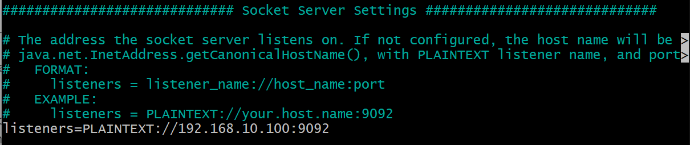

# Kafka Setup

1. Install Kafka on a VM using the provisioning script [here](https://github.com/bradley-woods/tech230-kafka/blob/main/provision-kafka.sh)

2. Start the Zookeeper and Kafka service if need be use the following:

    ```bash
    zookeeper-server-start.sh -daemon ~/kafka_2.13-3.5.0/config/zookeeper.properties

    kafka-server-start.sh -daemon ~/kafka_2.13-3.5.0/config/server.properties
    ```

3. You can stop the server using

    ```bash
    kafka-server-stop.sh
    ```

4. You can create a topic using the following command

    ```bash
    kafka-topics.sh --bootstrap-server <private-ip>:9092 --topic <topic-name> --create
    ```

5. To list topics

    ```bash
    kafka-topics.sh --bootstrap-server <private-ip>:9092 --list
    ```

6. To show details of a topic:

    ```bash
    kafka-topics.sh --bootstrap-server <private-ip>:9092 --topic <topic-name> --describe
    ```

7. To connect to the kafka service you can configure the 'server.properties' file, by adding the private and public addresses to listeners (private) and advertised.listeners (public), in this case we are using a local VM with a private IP address of 192.168.10.100, where Kafka's default port number is 9092:

    

8. Next, we can set up a producer using the Amazon Corretto 11 JDK to send a message.

9. To check the message was received, we can use a consumer on the Kafka machine to retrieve these messages:

    ```bash
    kafka-console-consumer.sh --bootstrap-server <private-ip>:9092 --topic <topic-name> --from-beginning
    ```

10. Can send a range of messages at once using a `for` loop but it will use **Sticky Partitioner** behaviour instead of **Round Robin**, which will send all the messages to the same partition instead of one by one. This improves performance through batching.

## Rebalancing of Consumers

### Eager Rebalance

- All consumers stop, give up membership of partitions
- Rejoin consumer group and get new assignment, it is random
- During short period of time, entire group stops processing ("stop-the-world" event)
- No guarantee the consumers will get the same partitions they used before

### Cooperative Rebalance (Incremental Rebalance)

- Reassignig small subset of partitions from one consumer to another
- Other consumers can still process uninterrupted
- Can go through iterations to find a stable assignment (incremental)
- Avoids "stop-the-world" events

### Kafka Consumer Partition Assignment Strategies

- Range Assignor: assigns based on per-topic basis, which can lead to imbalance
- Round Robin: assigns across all topics in round-robin, optimal balance
- Sticky Assignor: balanced and minimises movements when consumer join/leave the group
- Cooperative Sticky Assignor: supports cooperative rebalancing so consumers can keep on consuming from the topic
- Default (Range Assignor, Cooperative Sticky Assignor): use only Range Assignor by default but allows upgrading to Cooperative Sticky Assignor with a single rolling bounce to remove Range Assignor from the list

### Static Group Membership

When a consumer leaves a group, its partitions are revoked and reassigned. If it joins back, it will have a new member ID and new partitions are assigned, unless you specify a `group.instance.id` to make the consumer a 'static member'. Upon leaving, the consumer has up to `session.timeout.ms` to join back and get back its partitions, otherwise they will be reassigned. This is helpful to maintain local state and cache and avoid re-building the cache.

## Kafka Consumer Auto Offset Commit Behaviour

In the Java Consumer API, offsets are regularly committed. This enables at least once reading scenario by default. Offsets are committed when you call `.poll()` and `auto.commit.interval.ms` has elapsed.

## Safe Kafka Producer

Since Kafka 3.0 the producer is safe by default using the following settings:

- `acks=all`
- `min.insync.replicas=2`
- `enable.idempotence=true`
- `retries=MAX_INT`
- `delivery.timeout.ms=120000`
- `max.in.flight.requests.per.connection=5`

## Message Compression

Messages can be sent in large batches and compressed to optimise performance using a message compression tool such as 'Snappy' which has a good CPU/compression ratio balance.

### Advantages

- Smaller producer request size (compression ratio up to 4x)
- Faster to transfer data over network (less latency)
- Better throughput and disk utilisation in Kafka

### Disadvantages

- Producers and Consumers must commit some CPU cycles to compress/decompress

## Kafka Extended APIs for Developers

### Kafka Connect

Can use different connectors for commonly used data sources and sinks.

**Source connectors**: get data from common data sources such as PostgreSQL, MongoDB, Wikimedia, Twitter etc.

**Sink connectors:** publish data to common data stores such as MySQL, ElasticSearch, AWS S3, Redis etc.

- Makes it easy for developers to get data reliably into Kafka
- Can scale easily from small to company-wide ETL (extract, transform, load) pipelines
- Re-usable code
- Fault tolerant, idempotent, distributed and ordered

### Kafka Streams

Easy data processing and transformation library within Kafka. Can be used for data transformations, data enrichment, fraud detection and monitoring and alerting.

- Standard Java application
- No need to create a separate cluster
- Highly scalable, elastic and fault tolerant
- Exactly-once capabilities
- One record at a time processing (no batching)
- Works for any application size

### Kafka Schema Registry

Using a serialisation framework such as Apache Avro, a Producer sends data using a schema to a separate Schema Registry component which is validated with Kafka. When a Consumer reads the data, it will need the schema to read the data with to then produce the object and write to the target. This is good for safety when transferring data, if you need to ensure the data follows a specific format and schema.

- Store and retrieve schemas for Producers/Consumers
- Enforce backward/forward/full compatibility on topics
- Decrease the size of the payload of data sent to Kafka
